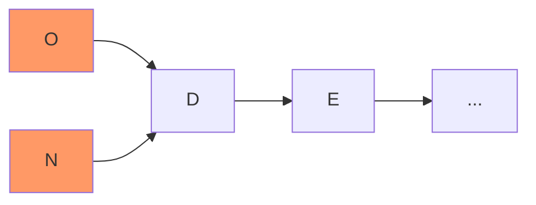
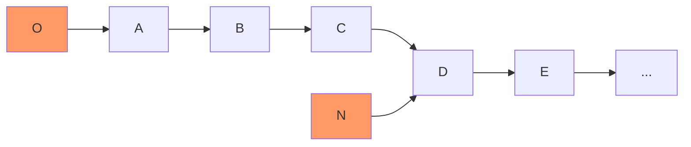
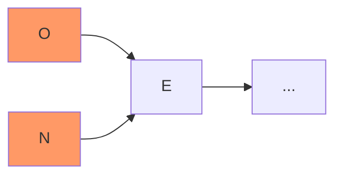

# Features Design
This document contains concise descriptions of how certain features are implemented.

## Optional Semicolon
Statements are often terminated by a semicolon (`;`) in many languages, but it is often quite tedious to write it when it can in fact be omitted. This is the case when a single statement is written on a single line (i.e., when the newline serves as an implicit statement delimiter.) 

To implement this behavior, the scanner must emit "newline" tokens[^newline-token], "multiline comment" tokens[^multiline-token], and "ignorable" tokens[^ignorable-token]. Later on, the compiler must check that expression statements end either with a semicolon, a newline, or a multiline comment (the latter is needed because when it actually spans multiple lines, it can be effectively treated as a newline.)

The simplest case is this:
```
print "hello"
```

Multiline comments `/**/` are expected to mark the end of a statement when they actually span multiple lines:
```
print "hello" /* there is an implicit
newline here */
```

But they should not be treated as a statement delimiter in situations such as this:
```
print "hello" /* there is an implicit
newline here */ + " world!"
```

We should be careful to not blindly treat newlines as implicit semicolons. The following expression, for example, should be treated as `print 12 + 12`:
```
print 12
    + 12
```

But multiple statements on a single line without a semicolon as separator should raise an error:
```
var item = "item" var name = "mike"
```

To properly implement this feature, it's important to realize that while the presence of those special tokens is needed, they must be tracked independently and not be mixed with regular tokens so as not to disrupt the token-driven parsing done in the `parse_only` function in `compiler.c`. Hence the field `immediately_prior_newline` in the `Parser` structure.

## Object Nursery
### The `push/pop` pattern
Throughout various chapters of [the book](https://craftinginterpreters.com/), a pattern is used consisting of pushing an object (or a value wrapping an object) onto the stack, only to be popped off after some other operation a few instructions later.

As it turns out, this apparently useless pattern is crucial for the correct operation of the garbage collector (GC). Consider the following snippet taken from `clox` (as originally implemented in the book):

```c
push_value(OBJECT_VALUE(string__copy(name, (int)strlen(name), vm)), vm);
push_value(OBJECT_VALUE(_class), vm);

table__set(
    &vm->global_vars, AS_STRING(vm->value_stack[0]), vm->value_stack[1]);

pop_value(vm);
pop_value(vm);
```

The reason why the "push/pop" pattern is needed here is because `table__set` may need to allocate more memory (if the table has grown too large and needs resizing), therefore potentially triggering a GC run. If this were to happen, the new string created by `string__copy` wouldn't be reachable from "the roots" (see [this chapter](https://craftinginterpreters.com/garbage-collection.html) for terminology) with disastrous consequences (i.e., the memory for the newly created string would be reclaimed, and we'd be inserting a corrupted value into the table.) 

Although the pattern seems relatively easy to implement and no longer mysterious once explained, it does have some serious drawbacks:

1. It adds visual/cognitive clutter to the code;
2. It makes the code slower by requiring additional pushes and pops on the stack;
3. It is easy to forget to add all required values onto the stack when the code is non-trivial. 

The last two drawbacks alone are sufficient to justify looking for alternatives. This is where the idea of the "object nursery" enters the picture.

### The "object nursery"[^object-nursery] as a better alternative
Since all we ever want is for recently created objects to not be reclaimed by the garbage collector before they've had a chance to be put in "safe" locations (e.g., in "roots" seen by the GC), why not just temporarily track recently created objects in the global `vm->objects` list and make them visible as roots during GC runs (e.g., using an "intrusive" sublist)?

Consider how the previous snippet would be written using this idea:

```c
memory__open_object_nursery(vm);

ObjectString* class_name = string__copy(name, (int)strlen(name), vm);
table__set(&vm->global_vars, class_name, OBJECT_VALUE(_class));

memory__close_object_nursery(vm);
```

Using this pattern, programmers just need to be aware of when an operation may trigger a GC run, and "wrap" it with `memory__open/close` calls. This couldn't get any simpler, and it removes all the drawbacks of the "push/pop" pattern.

As a way to simplify even further the usage of this "nursery" pattern, a macro `WITH_OBJECTS_NURSERY` can be used, which is simply defined as:

```c
#define WITH_OBJECTS_NURSERY(vm, block)                                        \
  {                                                                            \
    memory__open_object_nursery(vm);                                           \
    block;                                                                     \
    memory__close_object_nursery(vm);                                          \
  }

```

With this macro, the previous snippet is turned into the more palatable (and much less error-prone):

```c
WITH_OBJECTS_NURSERY(vm, {
  ObjectString* class_name = string__copy(name, (int)strlen(name), vm);
  table__set(&vm->global_vars, class_name, OBJECT_VALUE(_class));
});
```


#### Implementation Details
On the implementation side, things aren't that simple but they're also not that difficult to get right. The main idea is to set a pointer to the current value of `vm->objects` every time we "open the nursery", thus marking the end of the sublist of objects that will be protected from the garbage collector until they can be attached to "safe" (i.e., "reachable") objects. 

As newly created objects are added, this "intrusive" list (which always starts at `vm->objects` and ends at `vm->object_nursery_end`) grows, as illustrated in the following diagrams:

*Right after the nursery is opened:*


*After the nursery is opened and a few new objects are created:*


*After the nursery is created and a GC run happens right away, removing objects from the front of the list:*


where the highlighted nodes `O` and `N` represent the pointers `vm->objects` and `vm->object_nursery_end` (respectively), not actual objects as the rest of the nodes.

During garbage collection, it suffices to traverse this sublist and mark each object in it as alive. When the nursery closes (via `memory__close_object_nursery`), it suffices to set the corresponding pointer to `NULL` or to the current value of `vm->objects` to indicate the sublist is now empty.

One important detail to keep in mind is that the `memory__open/close` functions must be implemented to take into account the possibility of nested calls, in which case the semantics described earlier should continue to hold, namely: 1) the nursery should not be opened again if it is already open, and 2) the nursery should close only until the very first close call is made.

## Notes
[^newline-token]: Collapsing all contiguous whitespace that contains at least one newline into a single newline token is fine for the purposes of this feature.

[^multiline-token]: Not every `/*...*/` comment is emitted as a "multiline comment" token. Only those that actually span two or more lines are emitted as such; the rest are emitted as "ignorable" tokens.

[^ignorable-token]: "Ignorable" tokens are tokens which are not used to drive parsing/compilation, but which may be needed for features such as "optional semicolon". 

[^object-nursery]: The metaphor here is, of course, that we're creating a place to protect recently "born" objects from the claws of the "evil garbage collector" (which will kill any objects without parents or ancestors that are reachable from the roots).
